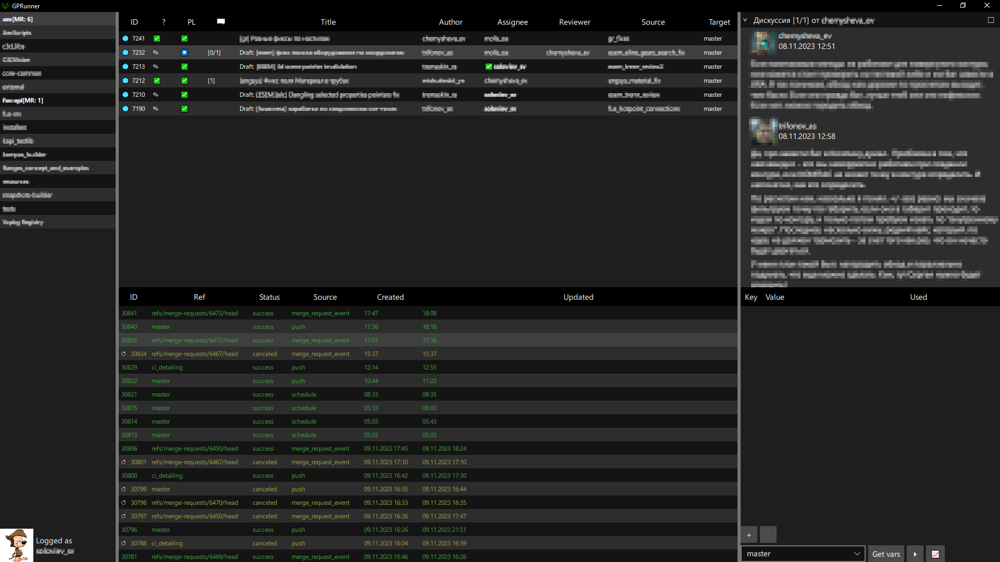

# GPRunner - GUI клиент для GitLab API
GPRunner (GitLab Pipeline Runner) - клиент для работы с GitLab API.  
Позволяет просматривать список доступных проектов в инстансе GitLab-а, просматривать MR-ы и состояние пайплайнов.  

Написан на `C++` с использованием фреймворка `Qt`.  
Для сборки требуется `Qt 6.5` и компилятор, поддерживающий фичи из стандарта `C++23`.

   

Для подключения к серверу необходимо завести Personal Access Token и указать его в файле конфигурации вместе с адресом сервера. См. [пример](./settings_example.json) файла (необходимо переименовать в `settings.json``).